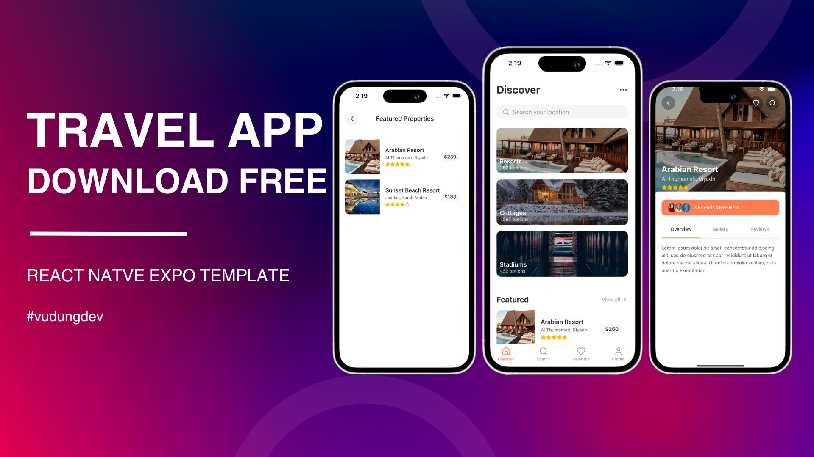

# Travel App - Your Next Adventure Starts Here! 🌍✈️



[](https://github.com/VuDoanDungVN/travel-app)
[](https://github.com/VuDoanDungVN/travel-app)
[](https://github.com/VuDoanDungVN/travel-app/issues)
[](LICENSE) <!-- Thay LICENSE bằng tên file license của bạn -->

## Overview

Embark on a journey of discovery with the Travel App! This ready-to-use application provides a user-friendly interface to explore destinations, plan trips, and get inspired for your next adventure. It's designed to be easily downloadable and immediately usable, allowing you to focus on what matters most: your travel experiences.

## Key Features

- **Intuitive Homepage:** A visually appealing and informative homepage to welcome users.
- **Reusable Components:** Built with modular and reusable components for easy customization and scalability.
- **Tab-Based Navigation:** Seamlessly navigate between different sections of the app using a convenient tab structure.
- **Ready to Use:** Download and run the application instantly. No complex setup required!

## Demo Video

See the Travel App in action! Watch the demo video to explore its features and functionalities:

[Watch the Demo Video](https://www.youtube.com/watch?v=Hu3E29qPwo0)

## Getting Started

### Prerequisites

Before you begin, ensure you have the following installed:

- [Node.js](https://nodejs.org/) (v16 or higher)
- [npm](https://www.npmjs.com/) (v8 or higher)

### Installation

1.  Clone the repository:

    ```bash
    git clone https://github.com/VuDoanDungVN/travel-app.git
    ```

2.  Navigate to the project directory:

    ```bash
    cd YOUR_REPOSITORY_NAME
    ```

3.  Install dependencies:

    ```bash
    npm install
    ```

### Running the Application

To start the development server, run:

```bash
npm start
```
